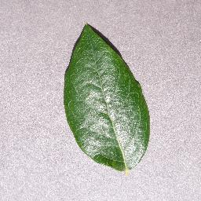

# Plant Disease Prediction using CNN




## Kaggle Dataset
You can download the dataset from [Kaggle](https://www.kaggle.com/datasets/abdallahalidev/plantvillage-dataset).

## Trained Model
add the build train model into trained_model file which drive link is availaible you have to download it in .h5 

## Installation and Usage

1. Clone the repository:
   ```bash
   git clone [https://github.com/uditkirar/plant-disease-prediction-cnn-deep-learning-project.git](https://github.com/UDITKIRAR/Plantrog-disease_classifier.git)
Navigate to the project directory:
bash
Copy code
cd app 
Install the required packages using pip:
bash
Copy code
pip install -r requirements.txt
Run the Streamlit app:
bash
Copy code
streamlit run main.py
This will start the Streamlit server, and you can then access the plant disease prediction application in your web browser.

Build model and integreate it with app mymodel (https://drive.google.com/file/d/1khHRY0CmXpTY3XP3UVMIehztyp18VasM/view?usp=drive_link) current accuracy==91% 
